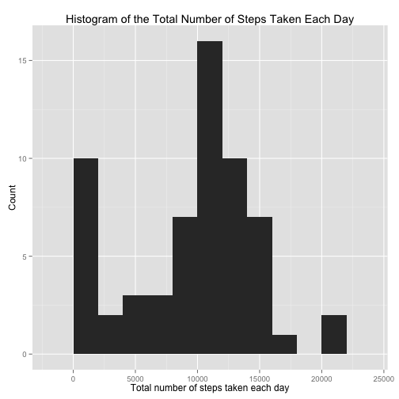

# Reproducible Research: Peer Assessment 1


## Loading and preprocessing the data

Unzip and load the data

```r
unzip("activity.zip")
data <- read.csv(file = "activity.csv",
                 na.strings = "NA",
                 colClasses = c("numeric", "Date", "numeric"))
head(data)
```

```
##   steps       date interval
## 1    NA 2012-10-01        0
## 2    NA 2012-10-01        5
## 3    NA 2012-10-01       10
## 4    NA 2012-10-01       15
## 5    NA 2012-10-01       20
## 6    NA 2012-10-01       25
```


## What is mean total number of steps taken per day?

```r
library(ggplot2)
library(plyr)

nsteps.per.day <- ddply(data, "date", summarise, 
                        total.steps = sum(steps, na.rm = TRUE))
head(nsteps.per.day)
```

```
##         date total.steps
## 1 2012-10-01           0
## 2 2012-10-02         126
## 3 2012-10-03       11352
## 4 2012-10-04       12116
## 5 2012-10-05       13294
## 6 2012-10-06       15420
```

```r
p <- ggplot(data = nsteps.per.day) +
        geom_histogram(aes(x = total.steps), binwidth = 2000) +
        labs(x = "Total number of steps taken each day",
             y = "Count",
             title = "Histogram of the Total Number of Steps Taken Each Day")   
print(p)
```

 

#### Mean and median total number of steps taken per day


```r
mean.steps.per.day <- mean(nsteps.per.day$total.steps)
print(mean.steps.per.day)
```

```
## [1] 9354
```

```r
median.steps.per.day <- median(nsteps.per.day$total.steps)
print(median.steps.per.day)
```

```
## [1] 10395
```


## What is the average daily activity pattern?


## Imputing missing values


## Are there differences in activity patterns between weekdays and weekends?
