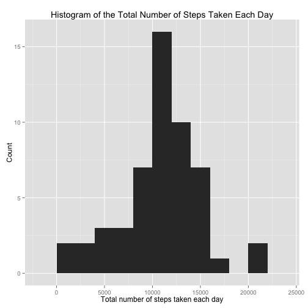
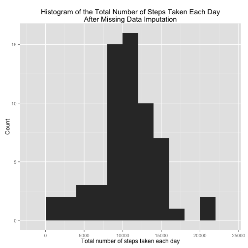
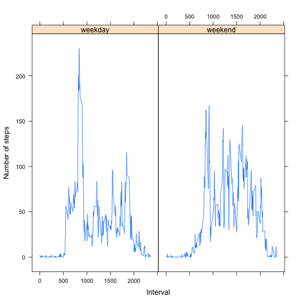

# Reproducible Research: Peer Assessment 1


## Loading and preprocessing the data

Unzip and load the data

```r
unzip("activity.zip")
data <- read.csv(file = "activity.csv",
                 na.strings = "NA",
                 colClasses = c("numeric", "Date", "numeric"))
```


## What is the mean total number of steps taken per day?

```r
library(ggplot2)
library(plyr)

# Ignoring missing values, working only with complete cases.
complete.data <- data[complete.cases(data),]

nsteps.per.day <- ddply(complete.data, .(date), summarise, 
                        total.steps = sum(steps))

ggplot(data = nsteps.per.day) +
        geom_histogram(aes(x = total.steps), binwidth = 2000) +
        labs(x = "Total number of steps taken each day",
             y = "Count",
             title = "Histogram of the Total Number of Steps Taken Each Day")
```

 

```r
# Mean of the total number of steps.
mean(nsteps.per.day$total.steps)
```

```
## [1] 10766
```

```r
# Median of the total number of steps.
median(nsteps.per.day$total.steps)
```

```
## [1] 10765
```

## What is the average daily activity pattern?


```r
avg.nsteps.per.interval <- ddply(complete.data, .(interval), summarise, 
                                average.nsteps = mean(steps))

ggplot(avg.nsteps.per.interval, aes(x = interval, y = average.nsteps)) +
        geom_line() +
        labs(x = "5-minute interval",
             y = "Daily average number of steps",
             title = "Average Daily Activity Pattern")
```

 

```r
## Maximum number of steps
max.steps <- max(avg.nsteps.per.interval$average.nsteps)
print(max.steps)
```

```
## [1] 206.2
```

```r
## 5-minute interval with the maximum number of steps
avg.nsteps.per.interval$interval[avg.nsteps.per.interval$average.nsteps == max.steps]
```

```
## [1] 835
```


## Imputing missing values

### Total number of missing values

There are a total of **2304** missing values (NA), all in the
_steps_ variable as shown in the summary bellow:


```r
summary(data)
```

```
##      steps            date               interval   
##  Min.   :  0.0   Min.   :2012-10-01   Min.   :   0  
##  1st Qu.:  0.0   1st Qu.:2012-10-16   1st Qu.: 589  
##  Median :  0.0   Median :2012-10-31   Median :1178  
##  Mean   : 37.4   Mean   :2012-10-31   Mean   :1178  
##  3rd Qu.: 12.0   3rd Qu.:2012-11-15   3rd Qu.:1766  
##  Max.   :806.0   Max.   :2012-11-30   Max.   :2355  
##  NA's   :2304
```

### Imputing missing values using the mean for the 5-minute interval

Missing values were imputed using the average number of steps taken for that
5-minute interval. This data is contained in the _**avg.nsteps.per.interval**_ 
dataframe reported above.


```r
## The function get.avg.step returns the average number of steps taken
## for a particular interval n.
get.avg.step <- function(n){
        avg.nsteps.per.interval$average.nsteps[avg.nsteps.per.interval$interval == n]  
}

## data.mi is a new dataset that is equal to the original dataset 
## but with the missing data filled in.

data.mi <- data
mi.indices <- which(is.na(data.mi)) # missing data indices

data.mi[mi.indices,]$steps <- sapply(
        data.mi[mi.indices,]$interval, get.avg.step)
```

### Histogram of the total number of steps taken each day after missing value imputation


```r
tsteps.df <- ddply(data.mi, .(date), summarise, total.steps=sum(steps))

ggplot(data = tsteps.df) +
        geom_histogram(aes(x = total.steps), binwidth = 2000) +
        labs(x = "Total number of steps taken each day",
             y = "Count",
             title = "Histogram of the Total Number of Steps Taken Each Day\nAfter Missing Data Imputation")
```

 

```r
# Mean of the total number of steps after m.d. imputation
mean(tsteps.df$total.steps)
```

```
## [1] 10766
```

```r
# Median of the total number of steps after m.d. imputation
median(tsteps.df$total.steps)
```

```
## [1] 10766
```

Using the strategy described above, missing data imputation does
not fundamentally change neither the mean nor the median values.


## Are there differences in activity patterns between weekdays and weekends?


```r
data.mi$tday <- weekdays(data.mi$date)

## dat.type function returns "weekend" or "weekday" depending on the day of the
## week
day.type <- function(day){
        ifelse(day == "Sunday" || day == "Saturday", "weekend", "weekday")
} 

data.mi$tday <- as.factor(sapply(data.mi$tday, day.type))
```


```r
library(lattice)

avg.nsteps.by.tday <- ddply(data.mi, .(interval, tday), summarise, 
                average.nsteps = mean(steps))

xyplot(average.nsteps ~ interval | tday, data = avg.nsteps.by.tday,
       type="l",
       xlab="Interval",
       ylab="Number of steps")
```

 
