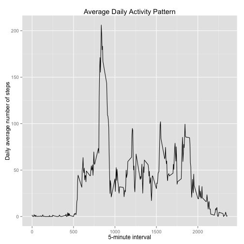

# Reproducible Research: Peer Assessment 1


## Loading and preprocessing the data

Unzip and load the data

```r
unzip("activity.zip")
data <- read.csv(file = "activity.csv",
                 na.strings = "NA",
                 colClasses = c("numeric", "Date", "numeric"))
```


## What is mean total number of steps taken per day?

```r
library(ggplot2)
library(plyr)

nsteps.per.day <- ddply(data, "date", summarise, 
                        total.steps = sum(steps, na.rm = TRUE))
head(nsteps.per.day)
```

```
##         date total.steps
## 1 2012-10-01           0
## 2 2012-10-02         126
## 3 2012-10-03       11352
## 4 2012-10-04       12116
## 5 2012-10-05       13294
## 6 2012-10-06       15420
```

```r
p <- ggplot(data = nsteps.per.day) +
        geom_histogram(aes(x = total.steps), binwidth = 2000) +
        labs(x = "Total number of steps taken each day",
             y = "Count",
             title = "Histogram of the Total Number of Steps Taken Each Day")   
print(p)
```

 

```r
# Mean of the total number of steps.
mean(nsteps.per.day$total.steps)
```

```
## [1] 9354
```

```r
# Median of the total number of steps.
median(nsteps.per.day$total.steps)
```

```
## [1] 10395
```

## What is the average daily activity pattern?


```r
ndays <- nrow(nsteps.per.day) # Total number of days

avg.nsteps.per.interval <- ddply(data, "interval", summarise, 
                                average.nsteps = sum(steps, na.rm = TRUE)/ndays)

head(avg.nsteps.per.interval)
```

```
##   interval average.nsteps
## 1        0        1.49180
## 2        5        0.29508
## 3       10        0.11475
## 4       15        0.13115
## 5       20        0.06557
## 6       25        1.81967
```

```r
p <- ggplot(avg.nsteps.per.interval, aes(x = interval, y = average.nsteps)) +
        geom_line() +
        labs(x = "5-minute interval",
             y = "Daily average number of steps",
             title = "Average Daily Activity Pattern")

print(p)
```

 

```r
## 5-minute interval with the maximum number of steps on daily average
max(avg.nsteps.per.interval$average.nsteps)
```

```
## [1] 179.1
```


## Imputing missing values

#### Total number of missing values

```r
summary(data)
```

```
##      steps            date               interval   
##  Min.   :  0.0   Min.   :2012-10-01   Min.   :   0  
##  1st Qu.:  0.0   1st Qu.:2012-10-16   1st Qu.: 589  
##  Median :  0.0   Median :2012-10-31   Median :1178  
##  Mean   : 37.4   Mean   :2012-10-31   Mean   :1178  
##  3rd Qu.: 12.0   3rd Qu.:2012-11-15   3rd Qu.:1766  
##  Max.   :806.0   Max.   :2012-11-30   Max.   :2355  
##  NA's   :2304
```

```r
mv <- sum(is.na(data))

# Missing Values
print(mv)
```

```
## [1] 2304
```

#### Imputing missing values using the mean for the 5-minute interval


```r
## Missing values were imputed using the average number of steps taken,
## averaged across all days. This data is contained in the avg.nsteps.per.interval
## dataframe reported above.

## The function get.avg.step returns the average number of steps taken, 
## rounded to the nearest integer, for a particular interval n.
get.avg.step <- function(n){
        round(
        avg.nsteps.per.interval$average.nsteps[avg.nsteps.per.interval$interval == n])  
}

## data.mi is a new dataset that is equal to the original dataset 
## but with the missing data filled in.

data.mi <- data
data.mi[which(is.na(data.mi)),]$steps <- sapply(
        data.mi[which(is.na(data.mi)),]$interval, get.avg.step)

summary(data.mi)
```

```
##      steps            date               interval   
##  Min.   :  0.0   Min.   :2012-10-01   Min.   :   0  
##  1st Qu.:  0.0   1st Qu.:2012-10-16   1st Qu.: 589  
##  Median :  0.0   Median :2012-10-31   Median :1178  
##  Mean   : 36.7   Mean   :2012-10-31   Mean   :1178  
##  3rd Qu.: 26.0   3rd Qu.:2012-11-15   3rd Qu.:1766  
##  Max.   :806.0   Max.   :2012-11-30   Max.   :2355
```

```r
head(data.mi)
```

```
##   steps       date interval
## 1     1 2012-10-01        0
## 2     0 2012-10-01        5
## 3     0 2012-10-01       10
## 4     0 2012-10-01       15
## 5     0 2012-10-01       20
## 6     2 2012-10-01       25
```

#### Histogram of the total number of steps taken each day after missing value imputation


```r
tsteps.df <- ddply(data.mi, "date", summarise, total.steps=sum(steps))

p <- ggplot(data = tsteps.df) +
        geom_histogram(aes(x = total.steps), binwidth = 2000) +
        labs(x = "Total number of steps taken each day",
             y = "Count",
             title = "Histogram of the Total Number of Steps Taken Each Day\nAfter Missing Data Imputation")   
print(p)
```

 

```r
# Mean of the total number of steps after m.d. imputation
mean(tsteps.df$total.steps)
```

```
## [1] 10581
```

```r
# Median of the total number of steps after m.d. imputation
median(tsteps.df$total.steps)
```

```
## [1] 10395
```

The mean of the total number of steps is
13.11
% greater after missing data imputation 
but the median has the same value. 


## Are there differences in activity patterns between weekdays and weekends?
